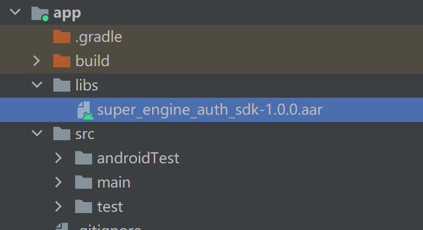

# SuperEngineAuthDemo
## **1.SuperStar链接配置**
请先完成SuperStar至你方App的跳转链接配置, 格式：scheme://host，
例如：weixin://com.tencent.wechat,后面接入的过程中会使用到

## **2.导入SDK**

#### **本地接入:**
将SuperEngineAuthSDK.aar复制到项目模块的libs目录下（目录结构如上图），并在模块的build.gradle文件中添加如下代码，SuperEngineAuthSDK依赖Okhttp，Glide, Gson，如果您的项目中未依赖，请添加相关依赖,


```
implementation files('libs/auth_sdk-release.aar')

//如果您的项目未添加下列的依赖，请添加，否则可忽略
implementation 'com.squareup.okhttp3:okhttp:4.4.0'
implementation 'com.github.bumptech.glide:glide:4.12.0'
implementation 'com.google.code.gson:gson:2.8.9'

```

## **3.初始化**
请在您的Application或继承类中初始化sdk

```java
//参数说明：接入过程中debug请传true，正式使用请传false
SuperEngineAuth.init(context: Context, debug: Boolean)  

```

## **4.接入**
在您的项目模块中，创建一个处理路由的Activity，用于处理跳转到SuperStar的认证页面，获取到您的App中的用户信息，跳转到认证页面，如果没有登录，则去登录，示例代码如下：

```java
class SchemeActivity : AppCompatActivity() {

    override fun onCreate(savedInstanceState: Bundle?) {
        super.onCreate(savedInstanceState)
        handleRoute()
    }

    private fun handleRoute() {
        if (SuperRouteUtil.handleRoute(intent.data)) {
            if (isLogin()) {
                //You are logged in||您已经登录，传递您的app中用户Id等信息，跳转认证页面
                val user = UserInfo(
                    Cache.userBean!!.userId!!,
                    Cache.userBean!!.userName!!,
                    Cache.userBean!!.avatarUrl!!
                )
                // 跳转到默认的认证页面 || Jump to the default authentication page
                SuperRouteUtil.goAuthPage(this, user)

                // 跳转到自定义的认证页面 || Jump to the custom authentication page
                // SuperRouteUtil.goAuthPage(this, user,CustomUIAuthActivity::class.java)

               // 跳转到自定义的认证页面2 || Jump to the custom authentication page
                //  SuperRouteUtil.goAuthPage(this, user,CustomUIAuthActivity2::class.java)

            } else {
                //You haven't logged in yet||您还没有登录，跳转登录
                startActivity(Intent(this, LoginActivity::class.java))
            }
        } else {
            startActivity(Intent(this, MainActivity::class.java))
        }

        finish()
    }

    private fun isLogin(): Boolean {
        return Cache.userBean != null
    }
}

```

在在您的项目模块中AndroidManifest.xml文字中，添加SchemeActivity的声明，并将第一步中配置的，链接应用到声明中，代码如下：

```xml
<-- 示例代码 -->
<activity
    android:name="com.superengine.auth.demo.SchemeActivity"
    android:exported="true">
    <intent-filter>
        <action android:name="android.intent.action.VIEW" />
        <data
            android:host="第一步中的host"/> 
            android:scheme="第一步中的scheme" />
        <category android:name="android.intent.category.BROWSABLE" />
        <category android:name="android.intent.category.DEFAULT" />
    </intent-filter>
</activity>

//实例
<activity
    android:name="com.superengine.auth.demo.SchemeActivity"
    android:exported="true">
    <intent-filter>
        <action android:name="android.intent.action.VIEW" />
        <data
            android:host="com.tencent.wechat"
            android:scheme="weixin" />
        <category android:name="android.intent.category.BROWSABLE" />
        <category android:name="android.intent.category.DEFAULT" />
    </intent-filter>
</activity>

```

## **5.混淆**
如果您的项目中开启了混淆配置，请在您的配置文件中添加如下语句；

```
-keep class com.superengine.auth.sdk.** { *; }
-keep interface com.superengine.auth.sdk.** { *; }
```
